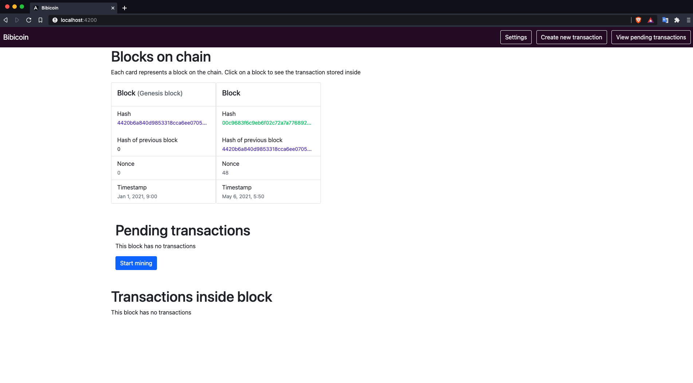

Bibicoin is a blockchain visualization frontend written with angular to help visualize and understand how blockchains work. The backend code was written with Javascript and imported as a library into this project. Check out [Block chain project](https://github.com/bilaalukis/blockchain-project) to see how the Transaction, Block and Blockchain classes were created and used.


# Preview


# Getting started
### Download and access repository
```
$ git clone https://github.com/bilaalukis/bibicoin.git
$ cd into the directory where you saved this project
```
### Installing dependencies and running server
```
$ run npm i
$ ng serve
```

# How to use the app
With the server running navigate to http://localhost:4200/



### Click streams
Each card represents a block on the bibicoin blockchain
- Click on a block to see its all transactions within it.
- Click on **Settings** to change the *mining difficulty* or *mining reward*
- Click on **Create new transaction** to add transactions onto the next block to be mined.
- Click on **Pending transactions** to see all transactions that will be added to the next block. You can also see this on the main page as well.

# Upcoming features
- Increase security with more validation checks

# Technologies used
### Backend: [Block chain project](https://github.com/bilaalukis/blockchain-project)
- Javascript in Node.js
- Crypto.js for SHA256 hashing
- Ellipse.js for generating private and public keys for a wallet

### Frontend:
- Angular
- Typescript
